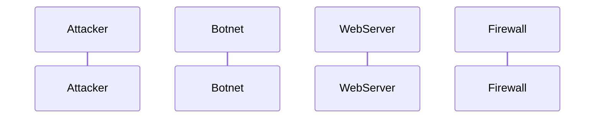

sequenceDiagram
    Attacker->>Botnet: What's your social security number?
    Botnet-->>Attacker: That's my personal information 
    Attacker-)Botnet: I'm reporting you for fraud
sequenceDiagram
    participant Attacker
    participant Botnet
    Botnet->>Attacker: Hi Attacker
    Alice->>Bob: Hi Botnet
sequenceDiagram
    participant A as Attacker
    participant B as Botnet
    A->>B: Hello Attacker, how are you doing?
    B->>A: Great!
Create participant B
A-->B:Hello
sequenceDiagram
    Attacker->>Botnet: Hello Botnet, how is it going?
    Botnet->>Attacker: Okay, thank you. And you?
    create participant Steve
    Attacker->>Steve: Hi Steve!
    create actor D as David
    Steve->>D: Hi!
    destroy Steve
    Attacker-xSteve: We are about to 
    destroy Botnet
    Botnet->>Attacker: I agree
Each participant contributes to the scenario because they all can pretend to pose as a malicious hacker that's trying to g to your get to your  personal idenity far as getting access to your social security card,bank statements, and other bills that are in your name. Defensive measures are triggered because personal information is getting hacked by those participants that are posing as malicious hackers.  
